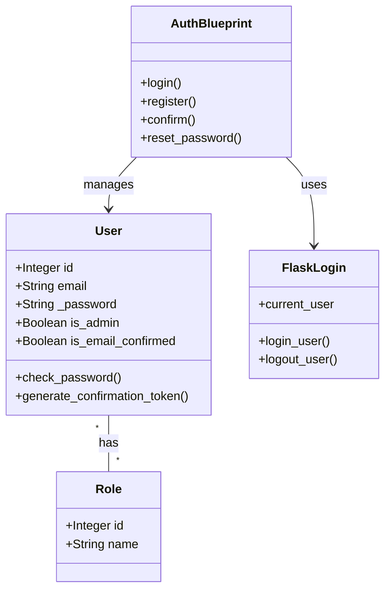

# Shopyo Auth Audit & Enhancement Plan

## Phase 1: Architecture Reverse Engineering

### 1. Core Architecture

The `shopyo-auth` package is a modular Flask blueprint designed to handle user authentication and role management within the Shopyo framework.



*   **Modules**:
    *   `models.py`: Defines `User` and `Role` models using SQLAlchemy. Includes password hashing logic and token generation.
    *   `view.py`: Contains Flask routes for authentication flows (login, register, logout, password reset).
    *   `forms.py`: Flask-WTF forms for input validation.
    *   `decorators.py`: Custom decorators `check_confirmed` and `roles_required` for access control.
    *   `upload.py`: Utilities for seeding the database with an initial admin user.
    *   `__init__.py`: Initializes the blueprint and registers it with the Flask app.

*   **Database Schema**:
    *   `users` table: Stores user credentials (`email`, `_password`), profile info (`first_name`, `last_name`), and status (`is_admin`, `is_email_confirmed`, `date_registered`).
    *   `roles` table: Stores role names (`name`).
    *   `role_user_bridge` table: Many-to-many relationship between users and roles.

*   **Configuration**:
    *   `SHOPYO_AUTH_URL`: Base URL prefix (default `/shopyo-auth`).
    *   `SHOPYO_AUTH_REGISTER`: Boolean to enable/disable registration.
    *   `SHOPYO_AUTH_LOGIN_FORGET_PASSWORD`: Boolean to enable/disable forgot password flow.
    *   `EMAIL_CONFIRMATION_DISABLED`: Boolean to skip email confirmation.
    *   `SEED_ADMIN_EMAIL` / `SEED_ADMIN_PASSWORD`: For initial admin creation.

### 2. Authentication Flow

*   **Registration**: User submits email/password -> Account created -> (Optional) Confirmation email sent -> User logged in immediately (Note: Login before confirmation is a potential security choice to review).
*   **Login**: Validates email/password hash -> `login_user()` (Flask-Login) -> Redirect to `next` or dashboard.
*   **Logout**: `logout_user()` (Flask-Login) -> Redirect.
*   **Password Management**:
    *   **Hashing**: Uses `werkzeug.security.generate_password_hash` (default: `pbkdf2:sha256`).
    *   **Reset**: Request reset -> Email with signed token -> Verify token -> Update password.
*   **Session Handling**: Delegated to `Flask-Login` (cookie-based).

### 3. Integration Points

*   **Flask-Login**: Used for session management (`UserMixin`, `login_user`, `current_user`).
*   **SQLAlchemy**: ORM for database interactions.
*   **Jinja Templates**: UI rendered via `templates/shopyo_auth/`.
*   **Email**: Uses `shopyo.api.email.send_async_email`.
*   **Shopyo API**: Uses `shopyo.api.html` for flash messages and `shopyo.api.security` for safe redirects.

---

## Phase 2: Security Audit (Military Grade)

### Vulnerability Ranking

| Vulnerability | Severity | Status | Description | Recommendation |
| :--- | :--- | :--- | :--- | :--- |
| **Weak Password Policy** | **HIGH** | ✅ **RESOLVED** | Now enforces complexity (min 12 chars, upper, lower, digit, special) when enabled. | Enforced via `PasswordComplexity` validator. |
| **Lack of Rate Limiting** | **HIGH** | ✅ **RESOLVED** | Throttling added to login/register via `Flask-Limiter`. | Configurable via `SHOPYO_AUTH_RATE_LIMIT`. |

| **Session Management** | **MEDIUM** | Relies solely on Flask-Login. No active session tracking or revocation capability. | Implement server-side session tracking (e.g., Redis or DB) to allow remote logout. |
| **Token Invalidation** | **MEDIUM** | Password reset tokens do not strictly invalidate upon password change (relies on salt/secret which are static). | Include user's `last_password_change` timestamp in the token signature. |
| **Enumeration** | **LOW** | Registration reveals if email is taken. | Use generic messages ("If account exists, email sent") or accept this as a UX trade-off. |
| **Plaintext PII** | **LOW** | User names and emails stored in plaintext. | acceptable for general use, but consider encryption for high-security environments. |

### Specific Findings

*   **Password Hashing**: Currently uses `pbkdf2:sha256` (default). While secure, `Argon2` is the modern standard for "military grade" security.
*   **Immediate Login on Register**: Users are logged in before confirming email. This allows unverified users access to authenticated routes immediately, unless specifically protected by `@check_confirmed`.
*   **Missing 2FA**: No support for Two-Factor Authentication.

---

## Phase 3: Simplicity Audit

The framework is already quite simple, adhering to Flask conventions. However, some simplifications can be made:

1.  **Consolidate Decorators**: `check_confirmed` and `roles_required` could be unified or better integrated into a policy engine to avoid stacking multiple decorators.
2.  **Configuration Centralization**: Move auth-specific config (password policy, rate limits) into a structured dictionary rather than flat keys.
3.  **Refactor `upload.py`**: The "seed admin" logic is specific. It should be a CLI command, not a module function implicitly called.

---

## Phase 4: Feature Gap Analysis

| Feature | Shopyo-Auth Status | Priority | Comparison (Modern Systems) |
| :--- | :--- | :--- | :--- |
| **OAuth / Social Login** | ❌ Missing | **Critical** | Standard in Auth0, Supabase, Django-Allauth. |
| **API Tokens** | ❌ Missing | **High** | Essential for headless/mobile apps (FastAPI style). |
| **MFA / TOTP** | ❌ Missing | **High** | Standard security requirement. |
| **Rate Limiting** | ❌ Missing | **High** | Built-in for most production auth systems. |
| **Session Management** | ❌ Missing | **Medium** | "Sign out all devices" is a standard feature. |
| **RBAC / Permissions** | ⚠️ Basic (Roles only) | **Medium** | Need granular permissions (policies), not just roles. |
| **Audit Logs** | ❌ Missing | **Low** | Enterprise requirement. |

---

## Phase 5: "Superpower" Enhancements

### 1. Pluggable Auth Providers (The "Passport" Strategy)
Allow users to register authentication backends (Local, Google, GitHub, LDAP) dynamically.

```python
# Concept
auth.register_provider("google", GoogleOAuthProvider(client_id="...", client_secret="..."))
```

### 2. Policy Engine (Granular Permissions)
Replace simple role checks with a logic-based policy engine.

```python
# Concept
@auth.require(policy="can_edit_post")
def edit_post(post_id):
    ...

# Definition
auth.define_policy("can_edit_post", lambda user, context: user.id == context.post.author_id or user.is_admin)
```

### 3. API Token System
Add support for generating and managing long-lived API tokens for third-party integrations or CLI usage.

### 4. Event Hooks
Publish events for other modules to react to (e.g., "send welcome email", "log login").

```python
@auth.on("user_registered")
def send_welcome_email(user):
    ...
```

---

## Phase 6: Developer Experience Improvements

### 1. CLI Commands
Add a `flask auth` CLI group.
*   `flask auth create-user --email ... --password ... --role admin`
*   `flask auth list-users`
*   `flask auth reset-password <email>`

### 2. Improved Configuration
Structure configuration clearly in config or .env
```
SHOP_AUTH_PASSWORD_POLICY =
SHOP_AUTH_MIN_LENGTH = 12
SHOP_AUTH_REQUIRE_SYMBOLS = True
SHOP_AUTH_RATE_LIMIT = "5 per minute"
SHOP_AUTH_PROVIDERS
SHOP_AUTH_GOOGLE
```

---

## Phase 7: Production Hardening

1.  **Rate Limiting**: Integrate `Flask-Limiter` to protect login/register endpoints.
2.  **Security Headers**: Ensure `Strict-Transport-Security`, `X-Content-Type-Options`, etc., are set (via `Flask-Talisman`).
3.  **Cookie Security**: Enforce `Secure`, `HttpOnly`, and `SameSite='Lax'` or `'Strict'` for session cookies.

---

## Phase 8: Refactor Plan

### Phase 1: Security & Hardening (Immediate)
*   **Action**: Update `forms.py` to enforce stronger password complexity.
*   **Action**: Integrate `Flask-Limiter` for brute-force protection.
*   **Action**: Update `models.py` to include `last_password_change` in token generation.
*   **Action**: Enforce `Secure` cookies in production config.

### Phase 2: Core Extensions (Short-term)
*   **Action**: Implement `API Token` model and authentication.
*   **Action**: Create `CLI` commands for user management.
*   **Action**: Refactor `decorators.py` into a basic Policy Engine.

### Phase 3: Advanced Features (Long-term)
*   **Action**: Implement `OAuth` provider interface.
*   **Action**: Add `MFA` support (TOTP).
*   **Action**: Build Session Management dashboard.

---

## Phase 9: Output Deliverables (Summary)

This plan provides a roadmap to transform `shopyo-auth` from a basic Flask-Login wrapper into a robust, enterprise-grade authentication system while maintaining its simplicity and modularity. The focus is on **security first**, followed by **developer experience** and **extensibility**.
